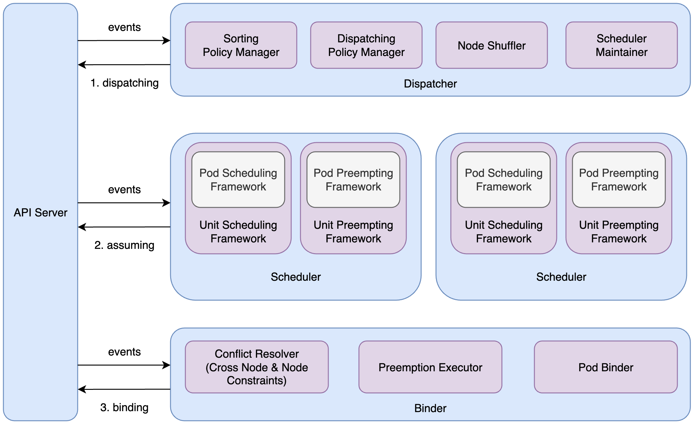

## Gödel Unified Scheduling System
Gödel represents a comprehensive scheduling and resource management platform designed for various business groups to efficiently operate their diverse cloud-native workloads. It features an integrated quota management system and a scheduler that administers a consolidated resource pool. The Gödel scheduling system is a critical component in the management of clusters.

Thanks to the Gödel architecture, we can realize enhanced performance in terms of resource utilization, resource elasticity, and scheduling throughput, optimizing the overall functionality and efficiency of cluster management.

## Overall Architecture

- Drawing inspiration from the Kubernetes scheduler and incorporating the concept of optimistic concurrency, we have optimized the most time-intensive process of matching application nodes—encompassing both filtering and scoring—within the scheduler component. This approach allows for concurrent execution, enhancing the scheduling throughput for large-scale clusters.

- Our two-tiered scheduling semantic abstraction, comprising Unit and Pod, along with its framework implementation, offers a more versatile "batch" scheduling capability. This significantly bolsters support for offline services while simultaneously enhancing throughput and scalability.

- The system boasts a plethora of features coupled with outstanding performance, fulfilling a diverse range of business requirements including online, offline (batch, stream), and training operations, thereby achieving truly unified scheduling.

- While remaining compatible with the Kubernetes ecosystem and serving as a potential substitute for the Kubernetes scheduler, our framework distinguishes itself through performance and architectural advancements. Although the framework interface deviates slightly from that of the Kubernetes scheduler, its extensibility remains uncompromised. Scheduling plugins can be developed in a manner akin to Kubernetes.

## Quick Start Guide for Key Features
Please refer to the below links for quick start guides on key features. Please note that Gödel supports Kubernetes versions from 1.21.4 up to 1.24.6. Using lower or higher Kubernetes versions may cause compatibility issues.

- [Basic Pod Scheduling](./docs/features/basic-pod.md)
<TODO Link the corresponding Markdown pages here>
- Gang Scheduling
- Job Level Affinity
- SubCluster Concurrent Scheduling
- Preemption

## Contribution Guide
Please refer to [Contribution](CONTRIBUTING.md).