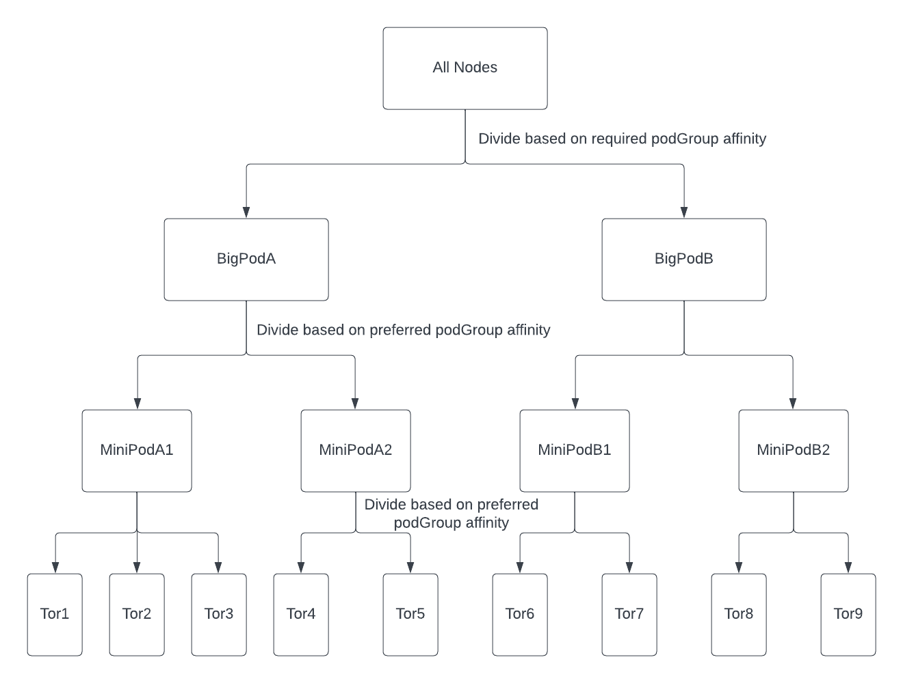
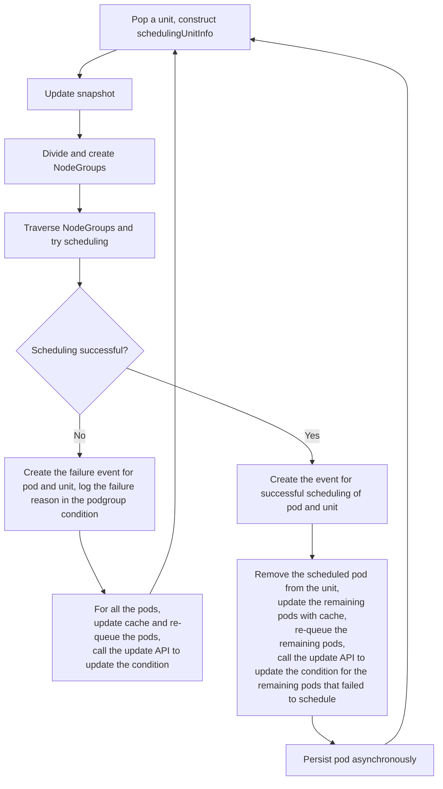

# Job Level Affinity in Godel Scheduler

## Introduction

The Godel Scheduler introduces the "Job Level Affinity" feature, a significant enhancement in the scheduling of PodGroups within a cluster.
This feature is designed to optimize pod placement based on network topology affinity, focusing on efficiently grouping Pods to minimize network overhead and maximize performance.

### Understanding Job Level Affinity

Job Level Affinity in Godel is about creating affinity at the level of a job, which comprises a group of Pods, referred to as a PodGroup.
The primary goal is to schedule these Pods within specific topology dimensions or domains of the cluster.
This approach is particularly beneficial for tasks involving extensive network communication, as it allows for Pods to be scheduled in the most efficient manner in terms of network topology.

### The Need for Enhanced Network Affinity

In complex tasks, like running large-scale computational models, the network communication between Pods imposes significant demands on network bandwidth.
Job Level Affinity addresses this by ensuring that Pods are placed within optimal network segments, such as within the same switch or minimizing the crossing of top-level switches.
In the network topology tree (e.g., bigPod -> miniPod -> tor -> node), it's crucial that physical nodes (leaf nodes) are as close as possible to each other as closer leaf nodes mean less network communication overhead and more efficient network.
Job Level Affinity strives to schedule Pods to minimize this distance, enhancing network performance.

### Key Features of Job Level Affinity

1. **Topology Domain Scheduling**: 
   - PodGroups are scheduled within specific topology domains that have hierarchical relationships. This is configured through the `PodGroupAffinity` field, similar to traditional Pod or Node affinity.

2. **Preferred and Required Affinity Terms**: 
   - These terms define the conditions for PodGroup scheduling.
   - **Required**: Specifies that Pods must be scheduled within the same network segment.
   - **Preferred**: A softer constraint, which divides nodes based on topology keys but allows for more flexibility in scheduling across different values within that topology.
   The 'preferred' array is ordered according to the actual topology layers from the largest to the smallest scale.
   This ordering is crucial for ensuring that the scheduler considers the topology layers in the correct hierarchy.

3. **Node Selector Integration**:
   - Incorporates node selectors in the PodGroup configuration to ensure Pods are scheduled on nodes meeting specific criteria, optimizing the scheduling process by pre-filtering nodes based on these requirements.

4. **Enhanced NodeCircle Sorting**:
   - When dividing NodeGroups based on affinity, the scheduler also creates NodeCircles within these NodeGroups, representing different levels within the network topology.
   Sorting of NodeGroups and NodeCircles is based on configurable strategies, considering either available or total resources (CPU, MEM, GPU) in ascending or descending order. 
   This approach enhances scheduling efficiency and minimizes resource fragmentation.

This introduction provides a fundamental understanding of Job Level Affinity in the Godel Scheduler, highlighting its role in optimizing Pod scheduling in accordance with network topology requirements.


## How to Use Job Level Affinity

Using Job Level Affinity in the Godel Scheduler involves configuring the `affinity` field in the PodGroup specification.
This configuration controls how PodGroups are scheduled within the cluster, based on their network topology and other criteria. 

### Setting Up Affinity in PodGroup Spec

1. **Configure Preferred and Required Affinity**:
   - **Preferred Affinity**: Indicates an attempt to schedule Pods in a specific domain within a topology dimension.
   If not feasible, it degrades to a higher-level domain. 
   At the same time, it aims to minimize crossings in the next lower-level topology domains to avoid random placement across the higher-level topology domain.
   - **Required Affinity**: Specifies that Pods must be scheduled within a specific domain of a topology dimension.

   Example:

   ```yaml
   apiVersion: scheduling.orchestration.bytedance.com/v1alpha1
   kind: PodGroup
   metadata:
     generation: 1
     name: nginx
   spec:
     affinity:
       podGroupAffinity:
         preferred:
         - topologyKey: nettoripv6
         required:
         - topologyKey: netminipodipv6
     minMember: 100
     scheduleTimeoutSeconds: 3000
     ```

2. **Setting NodeSelector in PodGroup Spec**:

    The NodeSelector syntax is similar to the Pod Spec NodeSelector, allowing for scheduling based on specific node attributes.

    Example:

    ```yaml
    apiVersion: scheduling.orchestration.bytedance.com/v1alpha1
    kind: PodGroup
    metadata:
      generation: 1
      name: nginx
    spec:
      minMember: 100
      scheduleTimeoutSeconds: 3000
      affinity:
        podGroupAffinity:
          nodeSelector:
            nodeSelectorTerms:
              - matchExpressions:
                - key: tor
                  operator: In
                  values:
                  - tor-0-1-7
    ```

3. **Configure SortRule in PodGroup Spec**:
    SortRules can be set to sort node groups based on resource dimensions like CPU, MEM, GPU, in either ascending or descending order.

    Example:

    ```yaml
    apiVersion: scheduling.orchestration.bytedance.com/v1alpha1
    kind: PodGroup
    metadata:
      generation: 1
      name: nginx
    spec:
      affinity:
        podGroupAffinity:
        preferred:
        - topologyKey: nettoripv6
        required:
        - topologyKey: netminipodipv6
        # SortRule
        sortRules:
        - order: Descending
          resource: GPU
          dimension: Capacity
        - order: Descending
          resource: CPU
          dimension: Available
      minMember: 100
      scheduleTimeoutSeconds: 3000
    ```

## Technical Design

The design of the Job Level Affinity feature in the Godel Scheduler encompasses several key components, each contributing to the effective and efficient scheduling of PodGroups based on network topology and other specified criteria.

### 1.**Network Topology Affinity**:

With the introduction of the Job Level Affinity feature, the Godel Scheduler now effectively supports complex, multi-layer network topologies.
This enhancement allows users to precisely specify affinity requirements for PodGroups.
Pods within a PodGroup are mandated to be scheduled within the same larger network segment, known as a BigPod, based on required affinity. 
Additionally, to further optimize network efficiency and resource utilization, Pods are preferentially scheduled within smaller, more localized network segments within a BigPod, known as MiniPods, based on preferred podgroup affinity.
In scenarios where a single MiniPod cannot accommodate an entire PodGroup, the scheduler intelligently distributes the PodGroup to nearby MiniPods within the same BigPod, thus minimizing inefficient network crossings. 
The following diagram provides a visual representation of this hierarchical network topology, illustrating how layers are structured:


#### Solution Design
The scheduler enhances PodGroup scheduling by considering unit-specific scheduling semantics:

1. **Require Semantics**: Mandates that the unit must be scheduled on specific nodes, following the unit require affinity.
2. **Prefer Semantics**: Strives to schedule the unit on certain nodes, following the unit prefer affinity. This also includes prioritizing nodes based on resource availability to prevent scheduling quality degradation due to partial node scans.

In the scheduling framework, nodes are organized into NodeGroups and sorted.
The scheduler sequentially processes each NodeGroup, deciding whether to allocate all pods of the unit to that group or not.
This structure is extended by organizing nodes into NodeGroups and NodeCircles:

- **NodeGroups**: A NodeGroup will either contain the entire unit or none of it.
- **NodeCircles**: If a unit's instances cannot fit entirely within one NodeCircle, scheduling of the remaining instances continues in the next NodeCircle.

#### Post-Development Scheduling Process
The enhanced scheduling process post-development is illustrated in the following flowchart:




### 2. **NodeCircle Support for NodeSelector**:

With the implementation of Job Level Affinity in the Godel Scheduler, business applications are assured of being scheduled within the same BigPod network segment and, as much as possible, within the same MiniPod segment.
However, within a single MiniPod segment, machines may vary in terms of their nodeLevel.
To address this, the Godel Scheduler has been enhanced to leverage Job Level Affinity capabilities along with nodeSelector information, ensuring that applications are scheduled on machines with the specified nodeLevel.

In the process of dividing NodeCircles, a NodeCircle corresponding to a MiniPod might include nodes with various other nodeLevels.
This diversity can lead to significant computational overhead for the scheduler, particularly when the podGroup is large and contains many nodes of unintended nodeLevels.
Consequently, this situation could substantially weaken the effectiveness of resource-based NodeCircle sorting.
Thus, incorporating nodeSelector semantics in the division of NodeCircles is essential.

#### Solution Design

The `PodGroupAffinity` structure in the CRD is defined as follows:

```go
type PodGroupAffinity struct {
   // Required represents a set of affinity terms, all of them MUST be satisfied
   // +optional
   Required []PodGroupAffinityTerm `json:"required,omitempty"`

   // Preferred represents a set of affinity terms that don't necessarily have to be satisfied.
   // But we need to try to satisfy
   // +optional
   Preferred []PodGroupAffinityTerm `json:"preferred,omitempty"`

   // SortRules indicates how the NodeCircles, aggregated by required or
   // preferred affinity, are sorted. The rule's index in slice is the sort
   // sequence. If this is not defined, we will sort NodeCircles in default sort rule.
   // +optional
   SortRules []SortRule `json:"sortRules,omitempty"`

   // NodeSelector specifies the requirements that must be met for the
   // podGroup's pods to fit on the nodes.
   // +optional
   NodeSelector *v1.NodeSelector `json:"nodeSelector,omitempty"`
}
```

### 3. **Enhanced NodeCircle Sorting**:

Following the division of NodeGroups and NodeCircles based on the required/preferred affinity of a podGroup in Job Level Affinity, it becomes necessary to sort these NodeGroups/NodeCircles to meet specific scheduling preferences.
This sorting strategy is configurable, allowing users to specify their preferences within the podGroup configuration.

#### Solution Design
The podgroup API definition include a `Dimension` field in `SortRule`, specifying the resource dimension to consider.
This field indicates whether the sorting should consider "Capacity" or "Available" resources, as shown below:

```go
// SortRule defines the rule for sorting items.
type SortRule struct {
    // Resource defines the dimension for sorting.
    Resource SortResource `json:"resource"`

    // Dimension may be either Capacity or Available
    Dimension SortDimension `json:"dimension"`

    // Order may be either Ascending or Descending
    Order SortOrder `json:"order"`
}
```

---

[Return to Main Documentation](../../../README.md)
