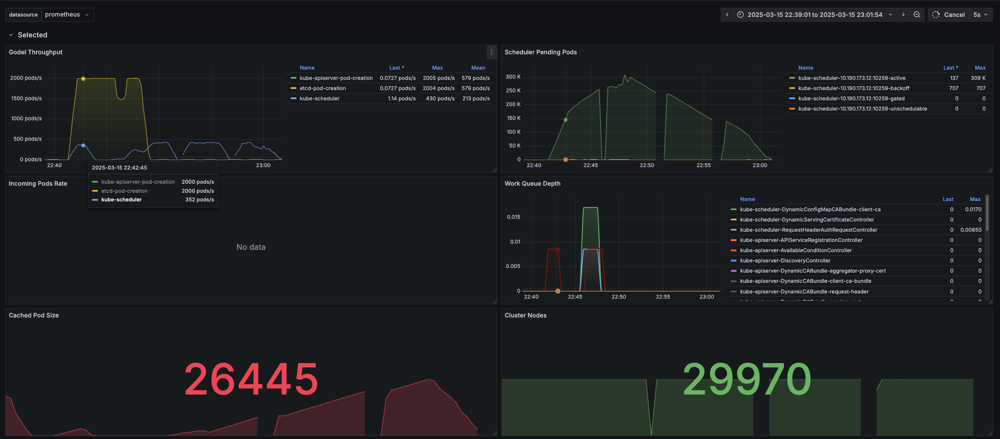
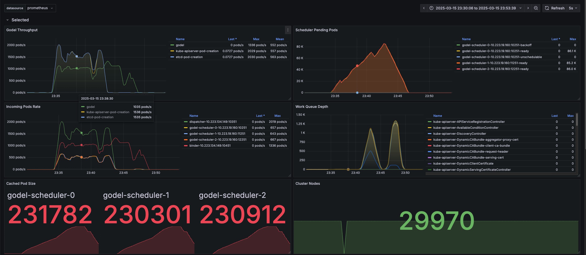

# Best Practices for the Performance Evaluation of Godel-Scheduler

## Hardware Configuration

To ensure reliable and reproducible performance evaluations, the following hardware configuration was used:

- **Physical Machines:** 1+ physical machines
- **Machine Specification:**
  - CPU: Intel(R) Xeon(R) Platinum 8260 CPU @ 2.40GHz (48 physical cores and 96 logical cores)
  - Memory: 384 GB
  - Storage: 1TB SSD/NVMe 
- **Operating System:** Debian GNU/Linux 10 (buster)
- **Kubernetes Version:** 1.29.14
- **Godel-Scheduler Version:** [commit e2cac0c](https://github.com/kubewharf/godel-scheduler/commit/e2cac0c99aaffeb24325e39f320ad17dbd05b8eb)

## Environment Setup
### Bootstrap a Vanilla Kubernetes Cluster
#### Kubeadm
In our evaluation, we deploy a vanilla Kubernetes cluster from scratch using kubeadm. Below is the config file we used for setting up the evaluation environment. To minimize the load of Kubernetes control plane, we also start a separate etcd server container for storing Event API objects.

First, starting a etcd server using docker. The related bash script is available at [deploy-etcd-for-events.sh](deploy-etcd-for-events.sh).
```bash
$ bash deploy-etcd-for-events.sh
```

Second, deploy a single-node Kubernetes cluster using kubeadm. The init config is available at [kubeadm-config.yaml](kubeadm-config.yaml).
```bash
$ kubeadm init --config kubeadm-config.yaml
```
#### KinD
Alternatively, it is much easier to bootstrap a Kubernetes cluster using KinD. For the sake of limited space, we skip the detail of how to use KinD. 

### Deploy Godel Scheduler
Next step, we deploy the Godel Scheduler onto the Kubernetes cluster. 
For the convience of readers, we prepare an example manifest, [godel-manifest](godel-manifest.yaml), for deploying Godel Scheduler. In this case, a 3-shard Godel Scheduler will be deployed.
```bash
$ kubectl apply -f godel-manifest.yaml
```

If everything goes well, you are expected to have the following observation.
```bash
$ kubectl -n godel-system get pod
NAME                           READY   STATUS    RESTARTS        AGE
binder-756c955459-rzwwm        1/1     Running   0               3d20h
dispatcher-6df6585c5b-f88j2    1/1     Running   0               3d20h
scheduler-0-56d577774b-xzkkk   1/1     Running   0               3d20h
scheduler-1-7b99cbbcb-8jwjd    1/1     Running   0               3d19h
scheduler-2-598f4c85fd-nmwxj   1/1     Running   0               3d19h
```

**Best Practice:**
To achieve better performance overall, we encourage users to deploy Godel Scheduler components 
onto dedicated nodes outside Kubernetes masters. Also, it would be better to deploy scheduler shards onto different nodes than those where dispatcher and binder are deployed.

### Simulate Large Cluster Scale using KWOK
First of all, we are supposed to deploy the kwok-controller. Here is an exmaple script, [deploy-kwok.sh](deploy-kwok.sh)
```bash
$ bash deploy-kwok.sh
```
Then, we can deploy the simulated large-scale cluster from the prepared node template, [node.yaml](node.yaml).
```bash
$ seq $ITERATIONS | xargs -I {} -P $NUM_PARALLELLISM bash -c "kubectl apply -f node.yaml"
```
In our case, we evaluate the performance of Godel Scheduler against the simulated clusters at the scale up to 30,000 nodes.

## Evaluation Configuration

### Key Information

- Create pods directly rather than any other advanced API objects, like, deployments, etc., so as to avoid the interference from the performance of kube-controller-manager.
- Make necessary configuration changes in kube-scheduler, so as to make it comparable to godel-scheduler.
  - Set both QPS and Burst to 10000, to keep them aligned with Godel.
  - Set log level to 4
- Update both max-mutating-requests-inflight and max-requests-inflight args in kube-apiserver to 10000 and 20000, respectively.
- Either kube-scheduler or godel-scheduler is enabled in any test scenario.

### Basic Parameters

- **Pod Creation Rate:** 2000 pods/s
- **Total Pods Created:** 800,000 pods
- **Cluster Scale:** 30,000 nodes

### Results and Analysis
**Notes**: we use an in-house test tool to achieve steady pod creation rate given adequate CPU resource being avaiable.

#### Kubernetes Scheduler
Under the evaluation setup, kube-scheduler can only achieve an end-to-end throughput at about 300 pods/s, and 430 pods/s at the peak. The performance of kube-scheduler is shown below. Obviously, the pod creation rate is pretty stable during the test.



#### Godel Scheduler
Instead, Godel Scheduler was able to keep a closer pace with the pod creation rate, achieving an end-to-end throughput around 1000 pods/s on average and more than 1300 pods/s at the peak. According to the screenshot, the pod creation rate can barely keep up at the specified level, which implies the Kubernetes control plane is short of resource in our test setup. Based on our production experience, Godel Scheduler could potentially achieve better performance with the help of much more powerful Kubernetes control plane and metadata store.



We also ran the controlled experiment with different combinations of parameter settings. The observation above is just one of the typical cases. As always, Godel Scheduler is designed to achieve high performance in terms of scheduling throughput within a large-scale cluster with heavy load. 
- In production, Godel Scheduler is able to stably support running up to 1 million pods on top of no more than 20K nodes with pod creation rate being up to 1000 pods per second.
- In benchmarking environment, Godel Scheduler is regularly tested to support running more than 1.5 million pods on top of 80K nodes with pod creation rate being up to 1000 pods per second.

## Tips for the Performance Evaluation
1. Use performant machines for the performance evaluation.
2. Update Kubernetes Master configuration properly to fully leverage the compute power of the Kubernetes control plane. Here is an [example](kubeadm-config.yaml).
3. Employ the multi-shard Godel setup to achieve higher throughput. Empirically, 3-shard setup is preferred.
4. Update the scheduler args to lower the log level (It is set to 4, by default, in Godel), and you will potentially observe another 10% bump of scheduling throughput. 
5. Last but not least, we are supposed to use expected annotations in the pod template in test. Otherwise, godel-dispatcher would waste a lot of cycles to reconcile such abnormal cases.
  ```yaml
    template:
      metadata:
        annotations:
          godel.bytedance.com/pod-state: pending
          godel.bytedance.com/pod-resource-type: guaranteed
          godel.bytedance.com/pod-launcher: kubelet
  ```
6. Make sure to either explicitly set the `schedulerName` for each pod to use the Godel Scheduler, or disable the kube-scheduler entirely in the cluster if you prefer not to update the `schedulerName` for each pod.