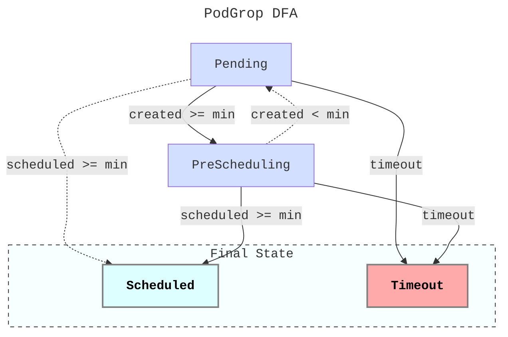

# Pod Group State Machine

**Explanation**: Based on the definition of [DFA](https://en.wikipedia.org/wiki/Deterministic_finite_automaton), let us use `State` to represent $Q$ and use `Msg` to represent $\Sigma$, then we have the following state-transition table.

| State \ Msg   | created < min | created >= min && scheduled < min | created >= min && scheduled >= min | timeout |
| ------------- | ------------- | --------------------------------- | ---------------------------------- | ------- |
| Pending       | -             | PreScheduling                     | Scheduled (Unexpected)             | Timeout |
| PreScheduling | Pending       | -                                 | Scheduled                          | Timeout |
| Scheduled     | -             | -                                 | -                                  | -       |
| Timeout       | -             | -                                 | -                                  | -       |

Please note that if both `created >= min && scheduled >= min` and `timeout` can be satisfied at the same time, it should be considered as **Scheduled**. We will use the `reentrant lock mechanism`[1] to ensure that the final state does not change.

> [1] Refer to `godel.bytedance.com/podgroup-final-op-lock` annotation